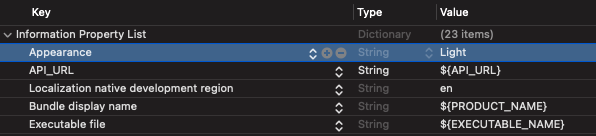

[](http://cocoapods.org/pods/Record360SDK)

Record360 iOS SDK
==================


# Introduction

The Record360SDK.framework is a Cocoa framework that allows mobile clients to leverage [Record360](https://www.record360.com).  This allows the client to track and record the condition of assets using the Record360 workflow.  An account with Record360 is required.  Please contact sales@record360.com for details.

# Requirements

-   iOS 12.0 or later
-   iPhone 8 and above.
-   iPad 4 and above.
-   iPad mini 2 and above.
-   iPod Touch 6G and above.

# Example

To run the example project, clone the repo, and run `pod install` from the Example directory.

# Preparation

In order to utilize the SDK framework, an account with Record360 is required.  Please contact sales@record360.com for details.

This SDK is not compatible with dark mode.  Please add the **Appearance** property to your info.plist file like this:



# Installation with CocoaPods

Record360 SDK can be installed using CocoaPods. CocoaPods is a dependency manager that automates the process of integrating 3rd-party libraries into your projects.  If you do not have CocoaPods, please see [CocoaPods](http://cocoapods.org) for details on how to install it.

### Podfile

Create a Podfile in your Xcode project directory with the following lines.
    
```ruby
platform :ios, '12.0'
use_frameworks!

pod 'Record360SDK', '~> 4.9.5' 
```

From the command line execute `pod install` to add the Record360SDK.

Note: If you want Drivers License verification functionality packed into the SDK, please contact us at sales@record360.com.

# Installation without CocoaPods

Record360 can provide the framework, contact support@record360.com for more information.

# Integrating Record360

### Starting the inspection upload handling process

1. Designate a Record360Delegate that will handle inspection upload events.  Note that the upload process is asynchronous, so the delegate will not be called immediately after the process completes.

```objectivec    
@interface MyApplicationViewController () <Record360Delegate>
```

2. Create a Record360 object that will handle file uploads and provide information about upload progress events to a delegate.  Pass in the delegate to handle the inspection upload events.

```objectivec    
Record360 *record360 = [[Record360 alloc] initWithDelegate:self];
```

3. Create a Record360ViewController object.  Pass in the login credentials, the already created record360 object, and a UIViewController to display the workflow process on.  Then set the delegate of the record360ViewController object in order to respond to workflow events.

```objectivec    
Record360ViewController *record360ViewController = [Record360ViewController loadControllerWithUserName:@"testuser@record360.com" andPassword:@"P@ssword!" sendTo:record360 displayOn:self]];

record360ViewController.delegate = self;
```

Your class should now look something like this:

```objectivec    
#import <Record360SDK/Record360.h>

@interface MyApplicationViewController () <Record360Delegate>

@property (nonatomic) Record360 *record360;

@end

@implementation

- (void)viewDidLoad {
    [super viewDidLoad];

    self.record360 = [[Record360 alloc] initWithDelegate:self];
}
```

4. After the inspection has finished or is canceled by the user, one of the Record360ViewController delegate methods will be called.

```objectivec
- (void)onInspectionComplete;
- (void)onInspectionCanceled;
```

5. If the inspection is uploading, implement the callbacks as specified by the Record360Delegate protocol.  When the Record360 object has finished uploading an inspection, one of the Record360Delegate methods will be called.

```objectivec
- (void)onInspectionUploadedForReferenceNumber:(nonnull NSString *)referenceNumber;
- (void)onInspectionUploadFailedForReferenceNumber:(nonnull NSString *)referenceNumber withError:(nonnull NSError *)error;
- (void)onInspectionUploadDeletedForReferenceNumber:(nonnull NSString *)referenceNumber;
```

# Record360 Class

This object handles inspection uploads.  If there are remaining inspections that haven’t been processed, the instance you create will process them when online.

Use the init method below to create a Record360 class:

```objectivec
- (nonnull Record360 *)initWithDelegate:(nullable id <Record360Delegate>)delegate;
```

Get/Set the property below for the upload mode.  Options include online, offline or wifi-only.  In wifi-only mode, the inspections will be uploaded when a wifi network is available.

```objectivec
@property (nonatomic, assign) UploadMode uploadMode;
```

The method below returns the number of inspections that are ready for upload.  Inspections that are in the process of uploading will be included in this count.

```objectivec
- (NSUInteger)getInspectionsReadyForUploadCount;
```

Use the method below to manually start uploading inspections:

```objectivec
- (void)startUploading;
```

Use the method below to manually stop uploading inspections:

```objectivec
- (void)stopUploading;
```

Use the method below to show a progress dialog UI over the passed in UIViewController:

```objectivec
- (void)showProgressDialogOnViewController:(nonnull UIViewController *)rootViewController onControllerClose:(nullable void (^)(void))onClose;
```

# Record360Delegate

Use these delegate methods to respond to various inspection upload events:

```objectivec
- (void)onInspectionUploadedForReferenceNumber:(nonnull NSString *)referenceNumber;
- (void)onInspectionUploadFailedForReferenceNumber:(nonnull NSString *)referenceNumber withError:(nonnull NSError *)error;
- (void)onInspectionUploadDeletedForReferenceNumber:(nonnull NSString *)referenceNumber;

@optional
- (void)onUploadBytesComplete:(long long)bytesComplete ofTotal:(long long)bytesTotal forReferenceNumber:(nonnull NSString *)referenceNumber;
```

# Record360ViewController Class

Use one of the below factory methods to create the Record360ViewController object that enters and displays the workflow.

These methods let the user specify their own reference number:

```objectivec
+ (Record360ViewController *)loadControllerLoginAndSendTo:(Record360 *)record360 withReferenceNumber:(nullable NSString *)referenceNumber workOrderId:(NSNumber *)workOrderId workOrderLabel:(NSString *)workOrderLabel displayOn:(UIViewController *)rootViewController showCancelButton:(BOOL)showCancel withLoginUsername:(nullable NSString *)username;

+ (Record360ViewController *)loadControllerWithUserName:(NSString *)userName andPassword:(NSString *)password andReferenceNumber:(nullable NSString *)referenceNumber workOrderId:(nullable NSNumber *)workOrderId workOrderLabel:(nullable NSString *)workOrderLabel sendTo:(Record360 *)record360 displayOn:(UIViewController *)rootViewController;

+ (Record360ViewController *)loadControllerWithUserToken:(NSString *)userToken andReferenceNumber:(nullable NSString *)referenceNumber workOrderId:(nullable NSNumber *)workOrderId workOrderLabel:(nullable NSString *)workOrderLabel sendTo:(Record360 *)record360 displayOn:(UIViewController *)rootViewController;

+ (Record360ViewController *)loadControllerWithUserToken:(NSString *)userToken andUserId:(NSString *)userId andReferenceNumber:(nullable NSString *)referenceNumber workOrderId:(nullable NSNumber *)workOrderId workOrderLabel:(nullable NSString *)workOrderLabel sendTo:(Record360 *)record360 displayOn:(UIViewController *)rootViewController;

+ (Record360ViewController *)loadControllerWithUserToken:(NSString *)userToken userId:(NSString *)userId referenceNumber:(nullable NSString *)referenceNumber workOrderId:(nullable NSNumber *)workOrderId workOrderLabel:(nullable NSString *)workOrderLabel andIsOneTimeLink:(BOOL)isOneTimeUseLink sendTo:(Record360 *)record360 displayOn:(UIViewController *)rootViewController;
```

These methods automatically insert a reference number:

```objectivec
+ (Record360ViewController *)loadControllerLoginAndSendTo:(Record360 *)record360 displayOn:(UIViewController *)rootViewController showCancelButton:(BOOL)showCancel withLoginUsername:(nullable NSString *)username;

+ (Record360ViewController *)loadControllerLoginAndSendTo:(Record360 *)record360 withTaskId:(NSString *)taskId displayOn:(UIViewController *)rootViewController showCancelButton:(BOOL)showCancel withLoginUsername:(nullable NSString *)username;

+ (Record360ViewController *)loadControllerWithUserName:(NSString *)userName andPassword:(NSString *)password sendTo:(Record360 *)record360 displayOn:(UIViewController *)rootViewController;

+ (Record360ViewController *)loadControllerWithUserName:(NSString *)userName andPassword:(NSString *)password andTaskId:(NSString *)taskId sendTo:(Record360 *)record360 displayOn:(UIViewController *)rootViewController;

+ (Record360ViewController *)loadControllerWithUserToken:(NSString *)userToken andUserId:(NSString *)userId sendTo:(Record360 *)record360 displayOn:(UIViewController *)rootViewController;

+ (Record360ViewController *)loadControllerWithUserToken:(NSString *)userToken andUserId:(nullable NSString *)userId andTaskId:(NSString *)taskId sendTo:(Record360 *)record360 displayOn:(UIViewController *)rootViewController;

+ (Record360ViewController *)loadControllerWithRefreshToken:(NSString *)authToken sendTo:(Record360 *)record360 displayOn:(UIViewController *)rootViewController success:(void (^)(void))success failure:(void (^)(RefreshTokenError refreshErrorCode))failure;
```

Use the above factory methods starting with the signature `loadControllerLoginAndSendTo` to have the SDK display the login UI before entering the workflow.  The `Record360` object will upload the resulting inspection.  The `rootViewController` will be used to show the view.

Use one of the methods below to configure the Record360ViewController object to modify the workflow process.  Some of these settings are preset, while others are customizable.  See the [Record360Setting](#Record360Setting) section below for more details.

```objectivec
- (void)applySettings:(nonnull NSArray<Record360Setting *> *)settings;
- (void)applyDefaultSettings:(nonnull NSArray<Record360Setting *> *)settings;
```

Sets whether to show the help screen on workflow entry.  Defaults to false.

```objectivec
- (void)setShowOnboarding:(BOOL)showOnboarding;
```

# Record360ViewControllerDelegate

Implement these delegate callbacks to hook into the workflow process:

```objectivec
- (void)onInspectionComplete;
- (void)onInspectionCanceled;

@optional

- (nonnull NSArray<Record360FieldData *> *)onReferenceNumberEntered:(nonnull NSString *)referenceNumber fieldData:(nonnull NSArray<Record360FieldData *> *)fieldData;
- (nonnull NSArray<Record360FieldData *> *)onContractFieldData:(nonnull NSArray<Record360FieldData *> *)fieldData;
- (void)onSuccessfulAuthenticationWithToken:(nonnull NSString *)userToken andUserId:(nonnull NSString *)userId;
- (void)onFailedAuthentication:(nonnull NSError *)error;
```
Use the delegate callback method below to push custom field data into the workflow process.  This data will populate the forms of the workflow as specified.  The [Example](#Example) project also contains a few examples of supplying data to the forms.

```objectivec
- (nonnull NSArray<Record360FieldData *> *)onReferenceNumberEntered:(nonnull NSString *)referenceNumber fieldData:(nonnull NSArray<Record360FieldData *> *)fieldData;
```

# Record360Setting

Use one of the below init methods to create a Record360Setting that can be used to modify the workflow process.  Use one of the Setting constants as the settingKey with the appropriate init method.  The [Example](#Example) project contains various settings configurations.

```objectivec
- (instancetype)initSetting:(nonnull NSString *)settingKey;
- (instancetype)initSetting:(nonnull NSString *)settingKey label:(nonnull NSString *)label;
- (instancetype)initSetting:(nonnull NSString *)settingKey canDisplay:(BOOL)canDisplay;
- (instancetype)initSetting:(nonnull NSString *)settingKey label:(nonnull NSString *)label canDisplay:(BOOL)canDisplay;
- (instancetype)initSetting:(nonnull NSString *)settingKey label:(nonnull NSString *)label link:(nonnull NSString *)link;
- (instancetype)initSetting:(nonnull NSString *)settingKey label:(nonnull NSString *)label recipient:(nonnull NSString *)recipient title:(nonnull NSString *)title;

- (instancetype)initOptionSetting:(nonnull NSString *)settingKey value:(nonnull NSString *)value;
- (instancetype)initOptionSetting:(nonnull NSString *)settingKey canDisplay:(BOOL)canDisplay value:(nonnull NSString *)value;

- (instancetype)initSwitchSetting:(nonnull NSString *)settingKey value:(BOOL)value;
- (instancetype)initSwitchSetting:(nonnull NSString *)settingKey canDisplay:(BOOL)canDisplay value:(BOOL)value;
```

Here is a list of settings and their possible values:

```objectivec
// Setting
extern NSString * const SETTING_UPLOAD_MODE;
// Possible values
extern NSString * const UPLOAD_MODE_ONLINE;
extern NSString * const UPLOAD_MODE_WIFI_ONLY;
extern NSString * const UPLOAD_MODE_OFFLINE;

// Setting
extern NSString * const SETTING_RESOLUTION;
// Possible values
extern NSString * const RESOLUTION_MEDIUM;
extern NSString * const RESOLUTION_HIGH;
extern NSString * const RESOLUTION_VERY_HIGH;

// On/Off switch settings
extern NSString * const SETTING_NATIVE_PHOTO_MODE;
extern NSString * const SETTING_NOTATIONS_ON_IMAGES;
extern NSString * const SETTING_VIN_SCAN;
extern NSString * const SETTING_REMEMBER_LOGIN;
extern NSString * const SETTING_ADD_TIMESTAMP_TO_MEDIA;

// Other settings
extern NSString * const SETTING_ACCOUNT;
extern NSString * const SETTING_LOGOUT;
extern NSString * const SETTING_VERSION;
extern NSString * const SETTING_SHOW_INTRO_VIDEO;
extern NSString * const SETTING_SEND_SUPPORT_LOG;
extern NSString * const SETTING_RATE_RECORD360;
extern NSString * const SETTING_LINKS;
extern NSString * const SETTING_SEND_EMAIL;
```

Questions? 

Alexis Valencia – alex@record360.com

Tobin Pomeroy –tpomeroy@record360.com

Visit us on the web at www.record360.com/business

# License

See the LICENSE file for more info on the Record360SDK license.
